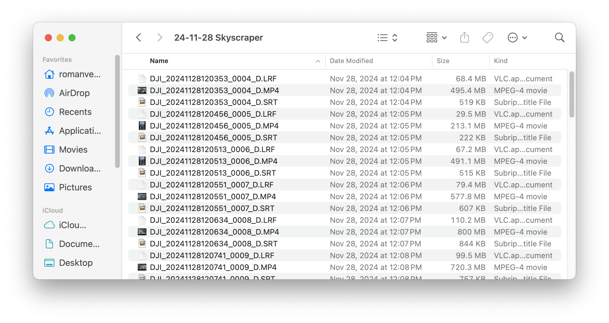
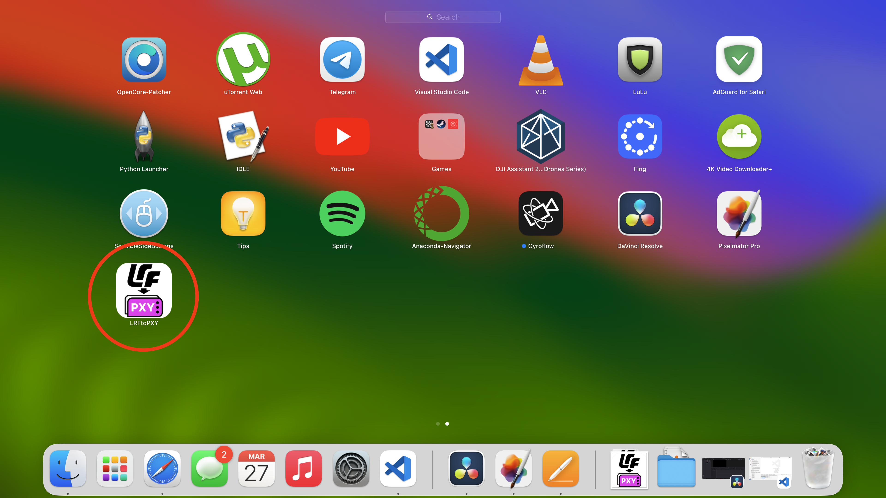
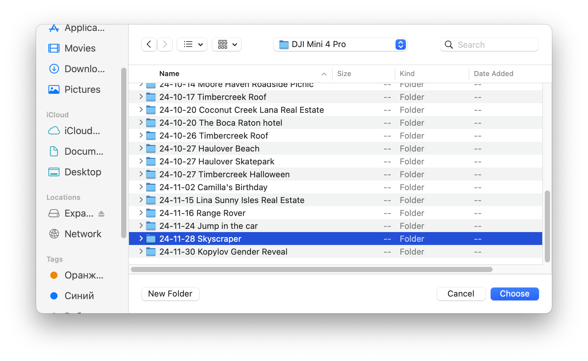
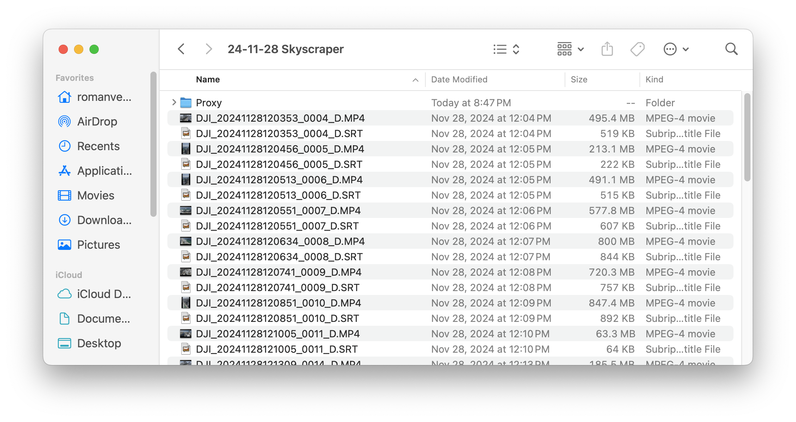
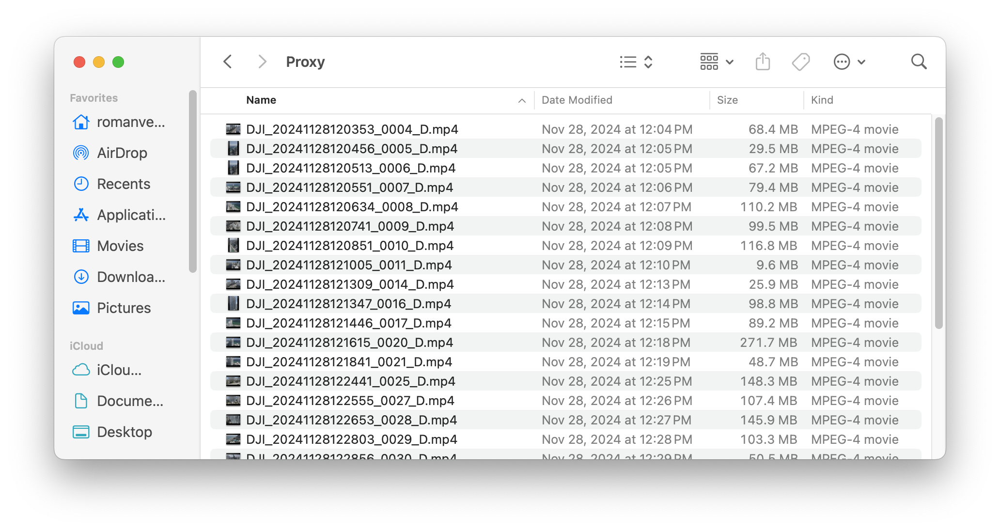
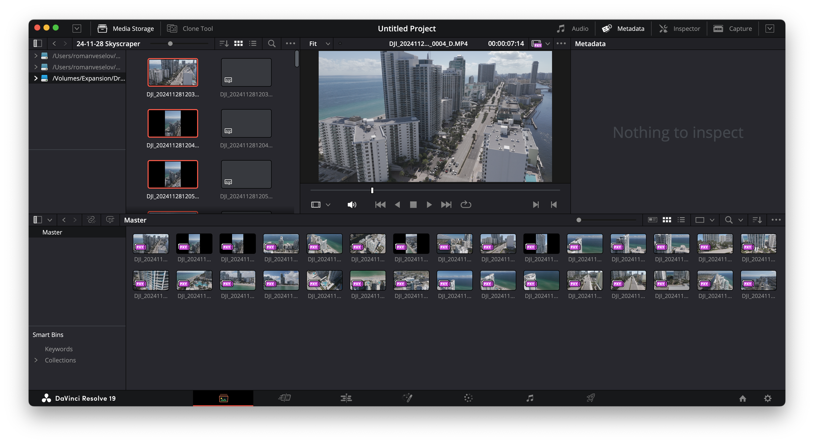

# LRFtoPXY

[Download dmg file](https://github.com/veselovich/LRFtoPXY/raw/refs/heads/main/LRFtoPXY.dmg)

This app is designed to help DJI drone operators easily reorganize their video files for use with DaVinci Resolve. The app automatically processes a folder of LRF files, moves them into a new folder "Proxy," and renames them to MP4 format. The low-resolution proxy files are ready for quick editing in DaVinci Resolve, streamlining the workflow for faster video editing and uploading.

### Install and open app:

### Select the Folder(s) with LRF Files:
When you launch the app, you'll be prompted to select a folder(s) containing your DJI drone LRF files. This folder is where the app will begin its processing

### Proxy Folder Creation:
The app automatically creates a new folder named "Proxy" within the selected folder. This will be the destination for all the LRF files that need to be processed

### Moving Files to the Proxy Folder:
Once the folder is selected, the app automatically moves all LRF files from the original location to the Proxy folder. After moving the files, the app renames each LRF file to the .mp4 format

### Proxy Files Ready for DaVinci Resolve:
After the app finishes processing, you can use original high-res files directly into DaVinci Resolve. Low-res files will automatically be available as proxy, speeding up editing. The original high-res files can then be used later for final rendering

